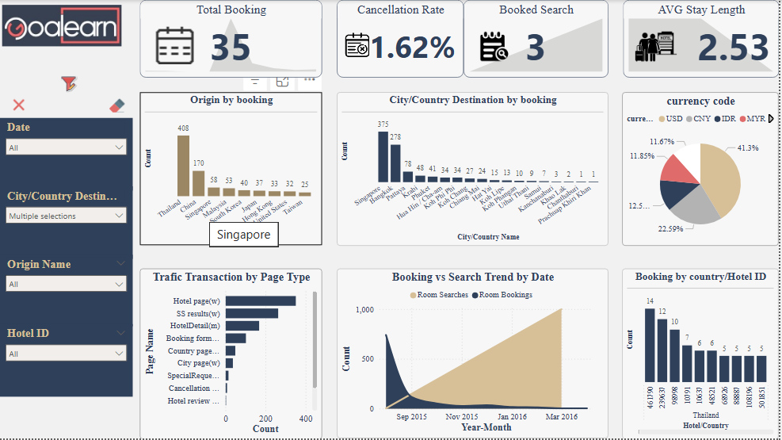

# 🏨 Hotel Booking Analytics – Data Warehouse Project  

[]()
[]()
[]()

---

## 📌 Project Overview  
The **Hotel Booking Analytics** project is designed to analyze hotel booking, search, and traffic activities using a **Data Warehouse (Star Schema)** model.  
Data is processed and visualized in **Power BI** to provide business insights on:  

- **Customer booking behavior**  
- **Traffic sources and page interactions**  
- **Search trends and demand forecasting**  

---

## 🎯 Objectives  
- Design and build a **Star Schema Data Warehouse** for hotel booking data.  
- Integrate multiple fact tables: **Bookings, Traffic, Searches**.  
- Provide **Power BI dashboards** for business intelligence and decision-making.  
- Deliver a **clear Data Dictionary** for maintainability and collaboration.  

---

## 📂 Data

This project uses hotel booking, search, and traffic datasets.  

- **Sample Data:** A small subset of the original dataset is provided in the `data/sample_data.xlsx` file for testing and reproducing the analysis.  
 
  - Includes all key columns to run SQL scripts and Power BI dashboard.  

- **Original Data:** The full dataset was used for analysis but is **not included** due to privacy and size constraints.  

📌 To run the project, you can start with the provided sample data and follow the SQL scripts in `sql/` to create fact and dimension tables.

---

## 🗂️ Project Structure  

```text
├── data/
│   ├── sample_data.xlsx             # A small subset of the original dataset
│
│── docs/
│   ├── data-dictionary.md           # Data Dictionary (detailed schema documentation)
│   ├── schema-diagram.png           # ERD / Star Schema visualization
│
├── sql/
│   ├── create_insert_tables.sql     # DDL scripts for schema creation
│
├── powerbi/
│   ├── BookingHotel.pbix            # Power BI dashboard file
│
├── screenshots/
│   ├── booking-hotel-dashboard.png  # Screenshot of dashboard in power BI
│
├── README.md                        # Project documentation (this file)
```

---

## 🏗️ Data Model  

The project follows a **Star Schema** design:

### 📌 Dimension Tables
- `Dim_date`, `Dim_time`, `Dim_origin`, `Dim_currency`, `Dim_page_type`  
- `Dim_destination_geo`, `Dim_country`, `Dim_hotel_country`  

### 📌 Fact Tables
- `fact_bookingtransaction`, `fact_traffictransaction`, `fact_searchtransaction`  

📌 See the [Data Dictionary](./docs/data-dictionary.md) for detailed column definitions.  
📌 ERD: [Schema Diagram](./docs/schema-diagram.png)  

---

## 📊 Power BI Dashboard  

Example of Booking Trends Dashboard:



The dashboard provides:  

### 🔑 Key KPIs
- **Total Bookings** – Total number of confirmed bookings within the selected period  
- **Cancellation Rate** – Percentage of bookings that were canceled out of total bookings  
- **Booked Searches** – Number of searches that successfully converted into bookings  
- **Average Stay Length** – Average duration of stay (in nights) for completed bookings  


### 🎛️ Filters
- **Date** – Filter by month, or year  
- **City / Country Destination** – Select destination at city or country level  
- **Origin** – Filter by the country where the search was initiated  
- **Hotel ID** – Focus on specific hotels  


### 📈 Visualizations
- **Column Chart: Bookings by Origin** – Shows booking distribution by customer’s origin country  
- **Column Chart: Bookings by Destination (City/Country)** – Highlights the most popular destinations  
- **Pie Chart: Top 5 Currency Codes** – Displays the top five currencies used in transactions  
- **Bar Chart: Page Type** – Breaks down traffic and bookings by page type  
- **Line Chart: Booking vs Search Trend** – Compares monthly booking trends against search trends  
- **Column Chart: Bookings by Country / Hotel ID** – Shows bookings by destination country and specific hotels  


> Example visualizations will be added in the `screenshots/` folder  

---

## ⚙️ Tech Stack  
- **Database**: SQL Server (T-SQL)  
- **Visualization**: Power BI  
- **Data Modeling**: Star Schema, ERD  
- **Documentation**: Markdown, Data Dictionary  

---

## 🚀 How to Use  

1. **Clone the repository**:  
   ```bash
   git clone https://github.com/FarnazOmidvari/hotel-booking-analytics.git
   cd hotel-booking-analytics
   ```

2. **Create the schema in SQL Server**:  
   ```bash
   sql/create_insert_tables.sql
   ```

3. **Load the Power BI dashboard**:  
   - Open `powerbi/BookingHotel.pbix`  
   - Connect to your SQL Server database  

---

## 📌 Next Steps  
- Add **sample datasets** for testing  
- Publish **Power BI dashboard screenshots**  
- Extend schema with **fact_paymenttransaction** (future scope)  

---

## 👩‍💻 Author  
**Farnaz Omidvari – Data Analyst**  
- 🕹️ SQL | Power BI | Data Modeling  

📧 farnaz.omidvari1983@gmail.com

💼 https://www.linkedin.com/in/farnazomidvari/

---

## 📄 License
This project is licensed under the MIT License – see the [LICENSE](LICENSE) file for details.


